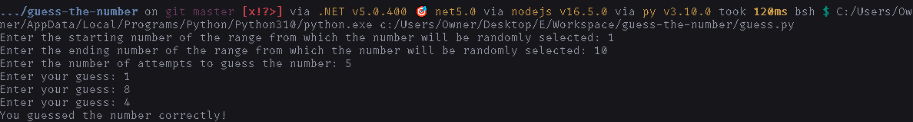
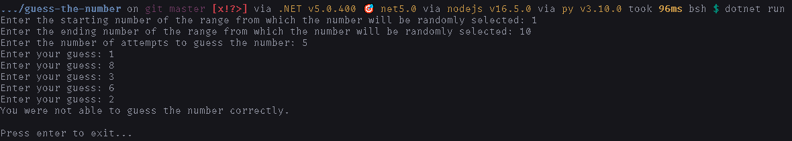
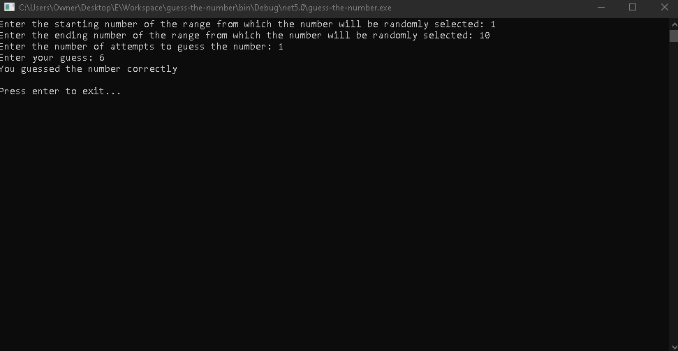

# How to run

Follow either of the 2 methods given below-:

## The easy way

1. Download `release.zip` from [the **latest** release](https://github.com/DhruvMitna/guess-the-number/releases/latest) and extract it.
2. Open the extracted folder and run the `exe` in it.

## The hard way

This program is available in both python and c#.

### Python

1. Install [python](python.org/downloads).
2. Download [`guess.py`](https://raw.githubusercontent.com/DhruvMitna/guess-the-number/master/guess.py) (by pressing `ctrl` + `s`).
3. Open the downloads folder and open `guess.py`.

### Csharp

1. Install the [dotnet](https://dotnet.microsoft.com) [sdk](https://download.visualstudio.microsoft.com/download/pr/c1bfbb13-ad09-459c-99aa-8971582af86e/61553270dd9348d7ba29bacfbb4da7bd/dotnet-sdk-5.0.400-win-x64.exe) and [runtime](https://download.visualstudio.microsoft.com/download/pr/f3bb58e7-45e1-46ef-9b90-877a450e345e/b18e3d2c429422e9c1238c9b66ded855/dotnet-runtime-5.0.9-win-x64.exe).
2. Download the [`obj`](https://github.com/DhruvMitna/guess-the-number/blob/master/obj/) folder and the file [`Program.cs`](https://raw.githubusercontent.com/DhruvMitna/guess-the-number/master/Program.cs) (by pressing `ctrl` + `s`).
3. Press `win + r`.
4. Type `'cmd'` and press enter.
5. Type `'cd Downloads'` and press enter.
6. Type `'dotnet run'` and press enter.

#### Examples

